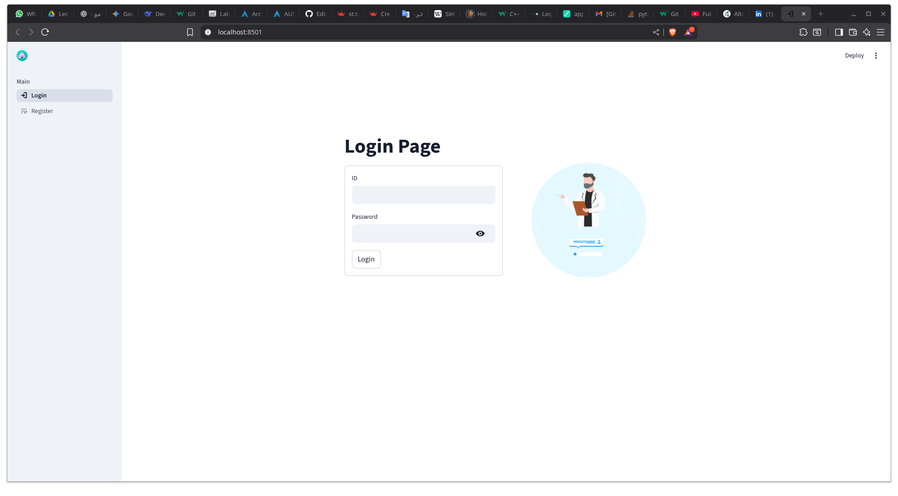

# 🏥 Hospital Management System

A modular, extensible Hospital Management System built with **Python**, **Streamlit**, and **Object-Oriented Architecture**.  
The project follows a clean multi-layer design consisting of **Core Models, Repositories, Services, and GUI Layers** to ensure scalability, maintainability, and separation of concerns.

---

## 🖼️ System Overview



> *Illustrates the layered architecture: Core → Data → Services → GUI*

---

## 🚀 Features

- Role-based access system:
  - **Patient**
  - **Doctor**
  - **Administrator**
- Patient management (Add / View / Delete)
- Doctor management (Add / View / Delete)
- Appointment scheduling & management
- Secure authentication (Login / Register / Logout)
- Data persistence using:
  - CSV (Patients, Doctors, Admins)
  - JSON (Schedules, Users)
- Repository-based data abstraction
- Fully modular OOP design

---

## 🏗️ Project Architecture

```text
Hospital-Management/
├── core/           # Core domain models (OOP Entities)
├── data/           # Repositories + Data storage (CSV / JSON)
├── services/       # Business logic layer
├── gui/            # Streamlit UI modules
├── config/         # Shared configuration / paths
├── assets/         # Screenshots / diagrams
└── main.py         # Entry point
